

# S B L&nbsp;&nbsp;&nbsp;E D I T I O N

**The weekly Sabbath Bible Lesson in its original booklet layout — mark it, write on it, save it as PDF.**

An independent edition of the SDARM Sabbath Bible Lessons

 

 

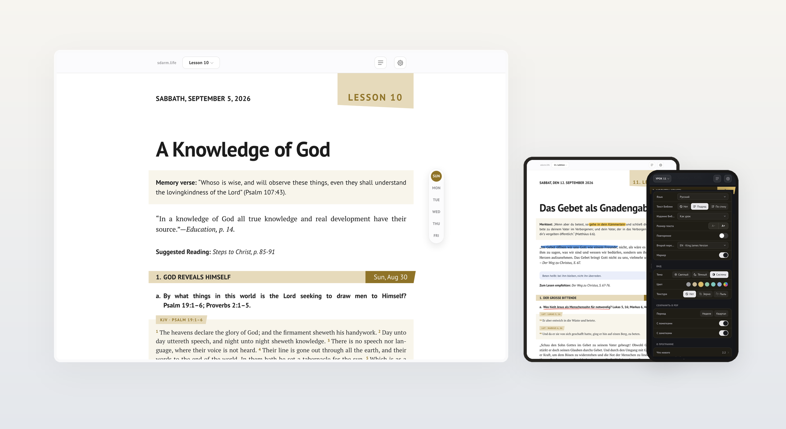

  

 

## What it is

The **Sabbath Bible Lesson** — the weekly Bible study booklet of the [Seventh Day Adventist Reform Movement](https://sdarm.org) — rendered as **one clean page you can save as PDF**.

Not a reading app. A **digital typesetting** of one particular publication: the same grey section bands, the same lesson tag, the same memory-verse box, the same grid as the printed quarterly. What you save is what the church hands out.

One language at a time — the booklet is published in **twenty-two**, and the picker offers every one the church's own service serves — with the full Bible text pulled live from SDARM, and everything cached so it keeps working without internet.

 

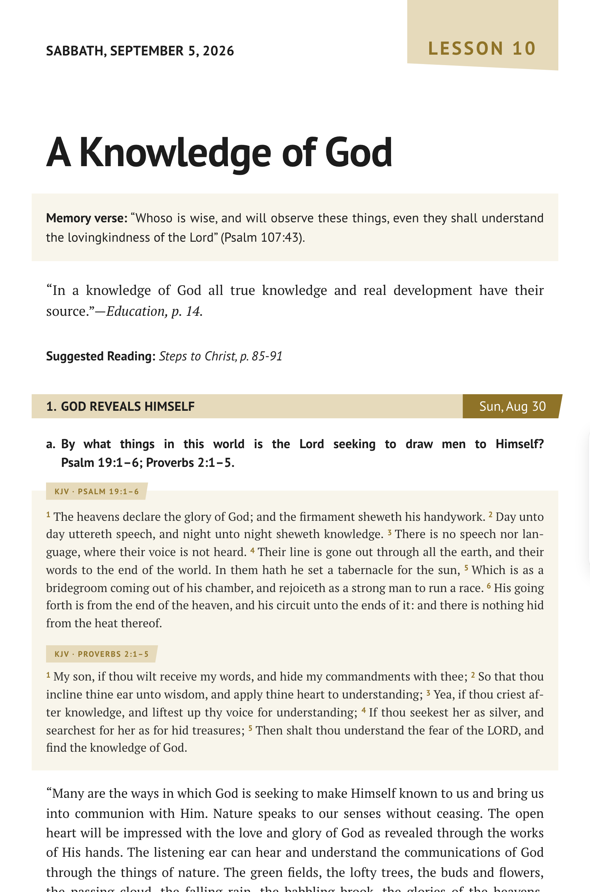

 

## Two ways to show the verses

Press **Verses** to print the full Bible text under every reference, then **≡** to choose how it is set:

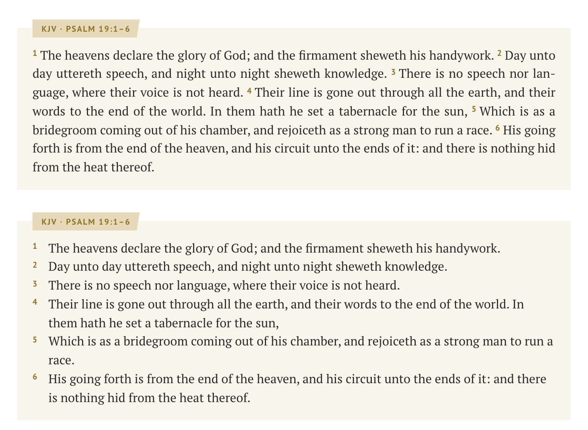

| | |
|---|---|
| **Running text** | Verses flow as one paragraph with small raised numbers — the way the booklet prints them |
| **One verse per line** | Each verse starts a new line, its number hanging in the margin — for slow, careful study |

The reference above the passage, the verse number and the first word of the question all sit on **one vertical line**.

 

## A hand on the sheet

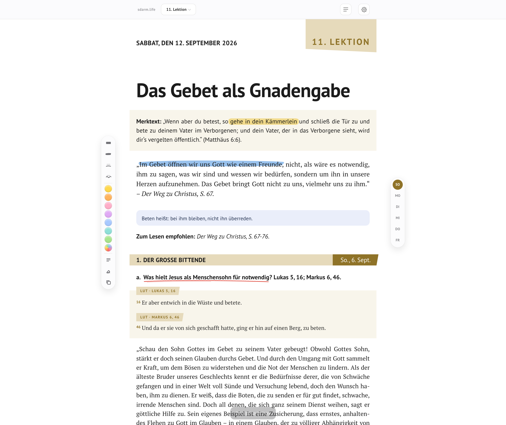

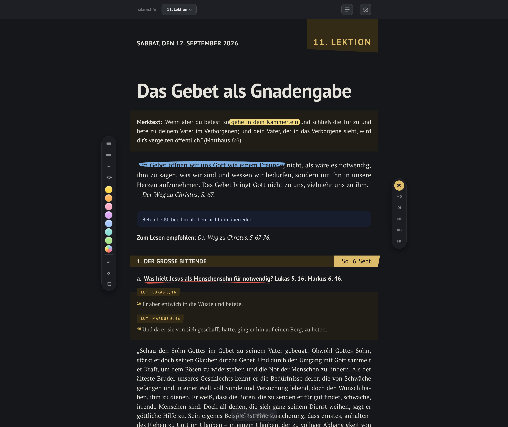

The lesson opens as a lesson: the text selects and copies like anywhere else. Turn **Marker and notes** on in ⚙ and a rail comes out beside the sheet — from then on it works the way a desk does: **take a tool, mark away, put it back.** Nothing pops up to be found and nothing closes after a click, so a whole lesson can be gone through phrase by phrase.

| | |
|---|---|
| **Four strokes** | Highlighter with the soft round nose of a felt pen, a rough-edged stroke, a hand-drawn line, a wave |
| **Any colour** | Seven last-used inks in the rail, the whole gamut behind the rainbow — the stroke under the hand changes colour as you drag through it |
| **Two passes go darker** | A second colour over the first behaves like real ink; the same colour twice does not muddy it |
| **Whole words** | A stroke never ends cutting a word in half, and a stroke that swallows a bold label or an italic title is laid as **one** mark — no seam, no notch, no white hairline |
| **Your own note** | Take ≡, click a paragraph — blue, in the other face, labelled and dated, so nobody mistakes it for the lesson |
| **Set like the lesson** | Inside a note: **bold**, *italic* and a quotation block set in the serif face with a rule down its side — three buttons at the head of the note, or ⌘B ⌘I ⌘⇧9, or simply start the line with `>` |
| **Your own words in the line** | Take ✚, click into the text — the field opens exactly where you clicked |
| **Copy with the reference** | A tool of its own: select a verse and the clipboard has the text with its reference |
| **Kept in the browser** | The counter at the foot of the rail says how much, and opens the page that says where |

Tap a stroke already on the page and it is picked up: the rail's colours and strokes now act on it, and a single ✕ takes it off.

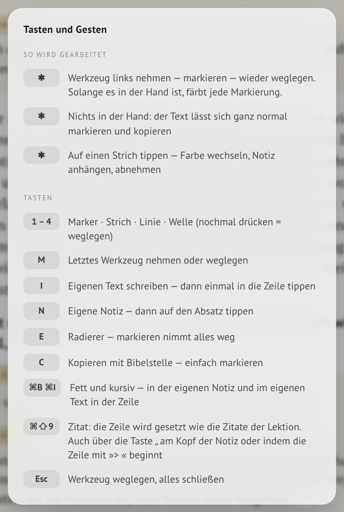

Keys do the same without reaching for the rail: **1 – 4** the strokes, **N** a note, **I** your own words, **E** the eraser, **C** copy, **M** the last tool, **Esc** put it down. Inside your own text **⌘B ⌘I** set bold and italic, **⌘⇧9** opens a quotation. They are all listed under **⚙ → Shortcuts**, in the language of the lesson.

 

## It all prints

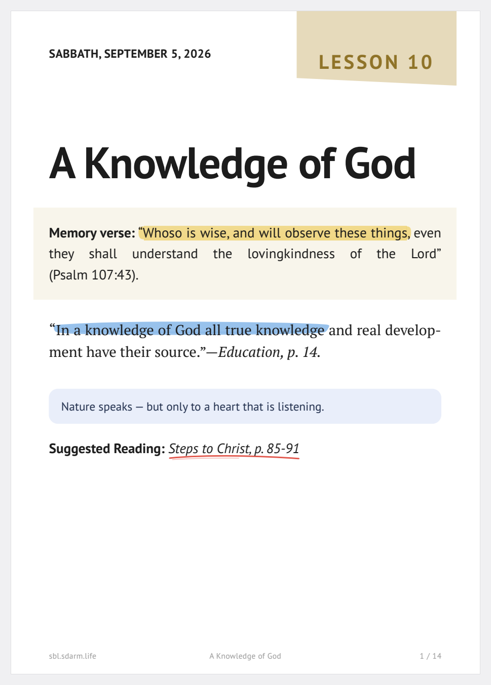

The ink is the background of the line itself, not an overlay pinned to the screen — so it flows with the text, breaks across pages with it, and arrives in the PDF exactly as it looked. At the foot of the sheet a line states that the blue is the reader's own and not part of the lesson.

 

## Save as PDF

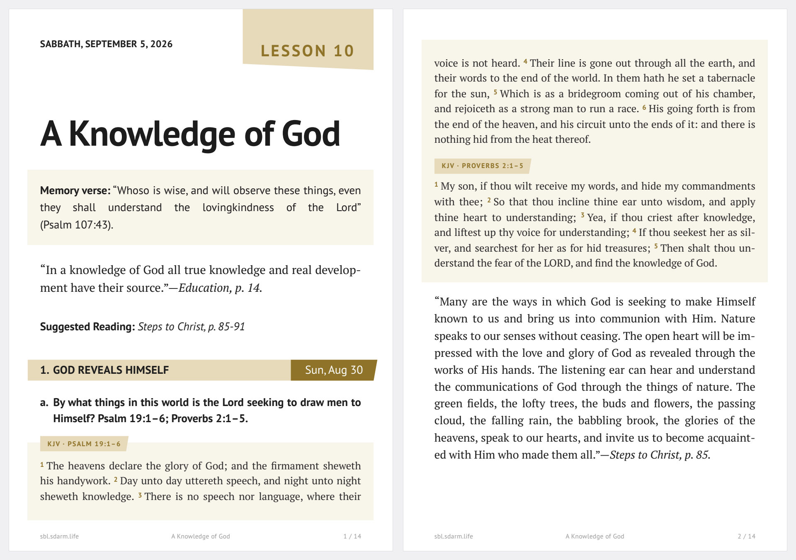

**↓ PDF** asks what to save:

| | |
|---|---|
| **This week** | One lesson — about 8 pages |
| **Whole quarter** | All 13 lessons in a single file, each opening on a new page |

The choice also switches what the page shows, so the whole quarter can be scrolled through before saving — once the dialog closes, the lesson you were reading comes back. The file is named after what it holds (`SBL 2026-08-08 LESSON 6 Faith and Acceptance`). Sheet size, margins, page numbers and the address line are set in the document itself — in the print dialog just switch **Headers and footers off** and the file comes out clean.

Long quotes and verse groups flow across the page break instead of jumping whole to the next sheet. A day never opens at the foot of a page: its heading, the question it starts with and the beginning of the text that answers it travel over together. Words break by the rules of the language being read — the Russian and German columns are set as tightly as the English one.

 

## On the phone and the tablet

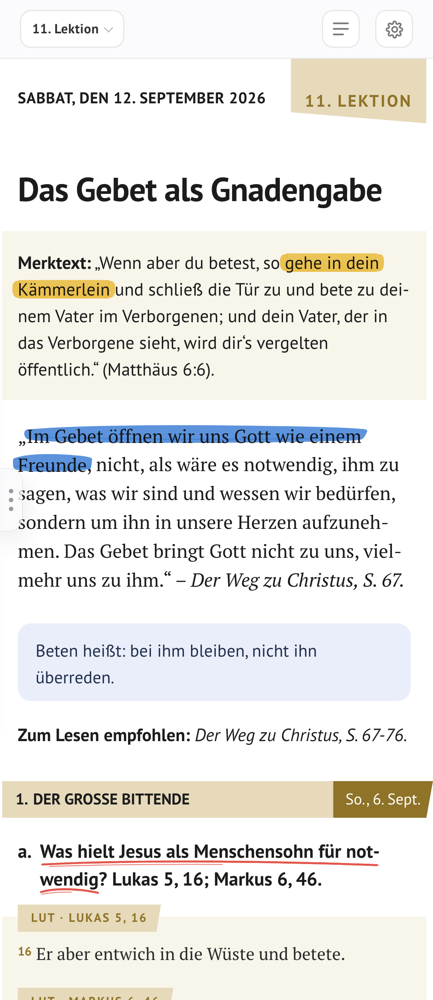

The toolbar folds into two rows and stays there — nothing wraps out of view down to 320 px. On a narrow screen justified text is set ragged-right instead, so no rivers of white run through the paragraphs. The PDF is unaffected: every phone rule sits behind `@media screen`.

Where the pointer is a finger the tools grow to match, and the rail lies down along the bottom edge instead of standing beside the page — on a phone in two even rows, so nothing has to be scrolled to be reached.

 

## Twenty-two languages

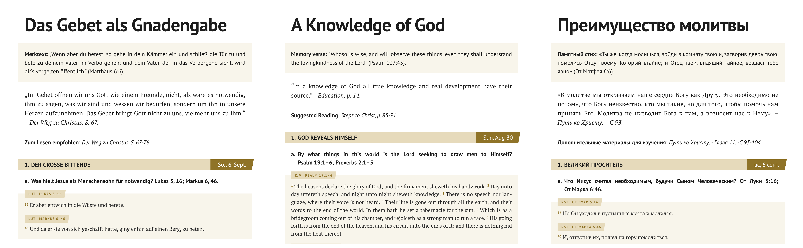

The booklet is read from Bulgarian to Zulu, and the picker names each language in its own words. Where a language has a Bible edition of its own the verses come in it — **Luther 1912**, **King James**, the **Синодальный перевод**, Reina-Valera, Almeida, Bible kralická, Louis Segond, Cornilescu; where it has none the reader says once, in ⚙, which edition he would rather read the passages in. Quotes from the Spirit of Prophecy carry their source, book title in italics, in whichever language the lesson is set.

 

## Colour the bands

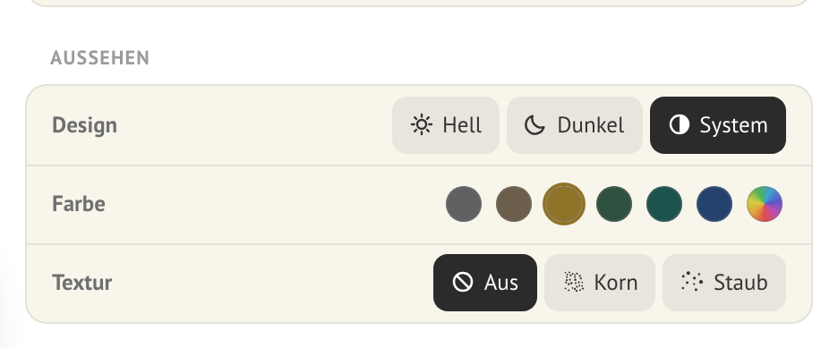

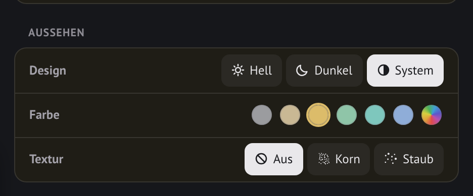

Five presets — grey, the quarterly's cover navy, wine, forest, gold — or any colour of your own from the wheel. The tint carries through the bands, the day tags, the verse rules and the colophon, and it is remembered.

 

## The controls

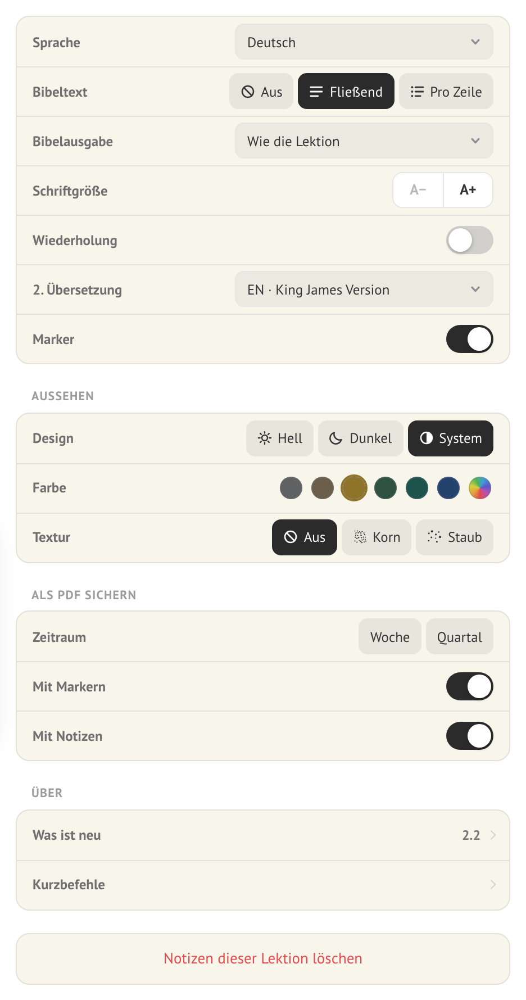
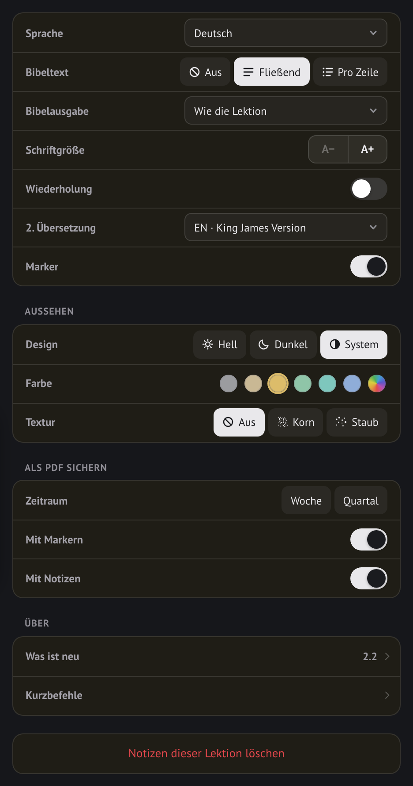

 

| | |
|---|---|
| **Lesson 6 ▾** | Opens the month: every week carries its lesson, and today is marked |
| **⚙** | Everything else — language, Bible text, type size, colour, marker, shortcuts, PDF |
| **← →** | A week at a time; a quarter at a time when the whole quarter is on screen |
| **⚙ → Marker and notes** | Brings the tool rail out beside the sheet, or puts it away |
| **1 – 4** | Highlighter · stroke · line · wave |
| **N · I** | Your own note after the paragraph · your own words inside the line |
| **E · C** | The eraser · copy with the reference |

 

## What 2.2 brought

**Twenty-two languages.** Croatian, Italian, Romanian and Tagalog join the list, and every code in it was asked of the server before it was written down. The Romanian lesson gained a Bible of its own — Cornilescu.

**The date line comes from the booklet.** It used to be assembled from a table of three languages: in nineteen of the twenty-two the word for Sabbath printed as `UNDEFINED`. The publisher prints that line himself, correctly, in every language and for every lesson — so it is taken, not made, and the booklet's own declension comes with it.

**The passages are shown from the start, and arrive as they come.** An edition is four to six megabytes; waiting for the last of them before showing the first meant a sheet of empty boxes. Now each passage is set the moment its own edition lands. Turning the passages on or off no longer rebuilds the sheet either — the reader's place and every mark stay where they were.

**A mark knows the words it was laid on.** Marks are stored as offsets into a block, so a publisher's correction used to slide them silently onto neighbouring words. Each mark now carries a signature of its paragraph: when the signature no longer matches, the marks in that paragraph are removed and the reader is told, and the rest of the lesson is left alone. Belt and braces — the current quarter is also frozen under `data/` in all twenty-two languages, so for most readers the text under a mark cannot move at all.

**The quarter opens like a booklet:** a title page, and its thirteen lessons listed with their dates.

**Typesetting.** A paragraph broken across the booklet's page turn is one paragraph again (twenty-two of them in a quarter). Russian quotations are set with guillemets instead of a double prime (258 in a quarter). A custom colour now has depth as well as hue, with both critical contrast pairs checked before the colour reaches the sheet.

 

## What 2.1 brought

**The tool comes first.** The rail stands beside the sheet with everything visible — four strokes, seven inks, the note, the insertion, the eraser, copying. No submenus, nothing that opens and shuts. And it stays out of the way until it is asked for: the lesson opens as a lesson.

**The stroke looks like a stroke.** Round felt-pen ends instead of a slanted cut, whole words instead of half ones, and one mark for the whole highlight — the dark notch where two pieces used to meet, and the white hairline where they used to part, are both gone.

**It is clear what is kept.** A counter at the foot of the rail, and behind it the page that says the marks live in this browser, per lesson and per language — and that the PDF is the copy to keep.

 

## What 2.0 brought

**The sheet can be marked.** Four strokes in any colour, laid down the moment the text is selected; two passes darken like real ink; the panel comes up below the selection and the browser's own menu no longer fights it. Everything is kept in the browser, per lesson and per language, and prints with the lesson.

**The reader can write on it.** A note after any paragraph and words inside the line itself — blue, in the other face, labelled and dated, with a line at the foot of the PDF saying they are not the lesson's own.

**The PDF was put right.** Words now break by the rules of the language being read: with the document fixed to English, Russian never hyphenated at all and German broke by the wrong rules — a whole quarter came out three pages longer and full of rivers. Printing waits for the type to be loaded instead of a timer. The sheet is A4 whatever the printer defaults to. A day heading no longer stands alone at the foot of a page. The lesson tag stopped printing into the top margin. The saved file is named after the lesson. Sending a quarter to the printer no longer leaves you stranded in the quarter afterwards. A stray booklet page number glued to the last word of a Russian review question is gone.

 

## Data & offline

Lesson texts and Bible editions come from the church's own source, `app.sdarm.org`, and nothing is rewritten — the page only sets the official text. The current quarter is frozen under `data/` in all **22** languages and answers first, so the publisher revising a quarter cannot move the text out from under a reader's marks. Anything not frozen is fetched live.

Where the text does change anyway, a mark does not move with it. Every mark is stored with a short signature of the paragraph it was laid on; when the signature no longer matches, the marks **in that paragraph** are removed and the reader is told — and the rest of the lesson is left exactly as it was. A mark that has quietly slid onto the wrong words is worse than a mark that is gone.

After the first visit a service worker keeps the quarter and the Bible, so the lesson opens instantly and works with no connection.

No build step, no framework, no dependencies — one HTML file and a service worker.

 

## Three ways to the same lesson

| | |
|---|---|
| **SBL Edition** — this one | **One** language, exact booklet layout, made for the **PDF** |
| [**manna**](https://github.com/TheMaestr-o/manna) | The same lesson in **two languages side by side**, for reading and comparing translations |
| [**MANNA-Photoshop-Lessons**](https://github.com/TheMaestr-o/MANNA-Photoshop-Lessons) | The daily lesson as a panel **inside Adobe Photoshop** |

 

## Notes

- Lesson content © [Seventh Day Adventist Reform Movement](https://sdarm.org); Bible text from SDARM's own editions. An independent reader, not affiliated with SDARM.
- A quarter holds 13 lessons; each runs Sunday to Friday, with the Sabbath carrying the week's overview and memory verse.
- [Impressum](impressum.html) · [Datenschutzerklärung](datenschutz.html)

 

## Support & Contact

## License

[MIT](LICENSE) — the code is yours to take. The lesson text and the Bible editions are not: they stay with the Seventh Day Adventist Reform Movement and their own publishers.

**© 2026 Serghei Galuscinshi**

 

---

**EN** — Sabbath School · Sabbath Bible Lessons · SDARM · Seventh Day Adventist Reform Movement · Bible study · church · devotional · quarterly

**RU** — АСДРД · Адвентисты Седьмого Дня Реформационного Движения · урок субботней школы · субботняя школа · Библия · церковь · квартальник

**DE** — STA Reformationsbewegung · Sabbatschule · Sabbatschullektion · Bibelstudium · Gemeinde

